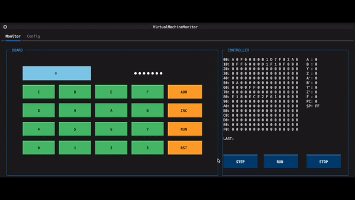

# ORANGE-4 Emulator

Emulator for [ORANGE-4](http://www.picosoft.co.jp/ORANGE-4/), a 4-bit microcontroller

***DEMO:***



This demonstration runs the sample code included with the ORANGE-4 IDE.

## How to use

1. Install ORANGE-4 IDE

    See [here](http://www.picosoft.co.jp/ORANGE-4/).

    [Download](http://www.picosoft.co.jp/ORANGE-4/download/ORANGE4-IDE-V102.zip)

2. Make image file
    Copy the results assembled in the IDE to a file.

    The following command generates an executable image.

    ```sh
    python ./hex-to-bin -i /path/to/in.hex -o /path/to/out.bin
    ```

3. Install the dependent libraries.

    ```sh
    python -m pip install textual
    ```

4. Run the emulator.

    ```sh
    python ./emulator -i /path/to/out.bin
    ```
